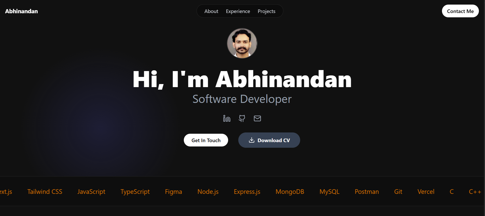

# Abhinandan's Personal Portfolio



This is the source code for my personal portfolio website, built to showcase my skills, projects, and experience as a Full Stack Developer. The site is designed to be modern, responsive, and performant.

**🔗 Live Site:** [**abhinandan-portfolio.vercel.app**](https://abhinandan-portfolio-eight.vercel.app/)

---

## 🚀 Tech Stack

This project was built using a modern tech stack to ensure a great developer and user experience:

-   **Framework:** [Next.js](https://nextjs.org/) (React Framework)
-   **Styling:** [Tailwind CSS](https://tailwindcss.com/)
-   **Animations:** [Framer Motion](https://www.framer.com/motion/)
-   **Deployment:** [Vercel](https://vercel.com/)
-   **Icons:** [Lucide React](https://lucide.dev/)

---

## 🛠️ Getting Started

To get a local copy up and running, follow these simple steps.

### Prerequisites

Make sure you have Node.js and npm installed on your machine.

-   npm
    ```sh
    npm install npm@latest -g
    ```

### Installation

1.  Clone the repo
    ```sh
    git clone [https://github.com/YOUR_USERNAME/YOUR_REPOSITORY.git](https://github.com/YOUR_USERNAME/YOUR_REPOSITORY.git)
    ```
2.  Navigate to the project directory
    ```sh
    cd abhinandan-portfolio
    ```
3.  Install NPM packages
    ```sh
    npm install
    ```
4.  Run the development server
    ```sh
    npm run dev
    ```
    Open [http://localhost:3000](http://localhost:3000) with your browser to see the result.

---

## 📫 Contact

Abhinandan - [@linkedin](https://linkedin.com/in/abhinandan5) - abhinandan.nitraipur@gmail.com

Project Link: [https://github.com/abhinandan5/abhinandan-portfolio](https://github.com/abhinandan5/abhinandan-portfolio)
